# Architecture Walkthrough

The following diagrams and explanations explain how our basic architecture works. This general architecture is used for the following tasks:

- Fetching survey responses from S3
- Fetching survey response analytics from S3

## Success case

### Step 1

The Bloc starts by emitting an Initial State. This signifies that nothing has happened yet.

The View reads the state from the Bloc, sees that it is an Initial State, and displays a message or symbol showing that nothing has happened yet.

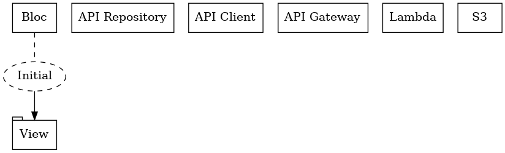

### Step 2

The View adds a Load Event to the Bloc, and the Bloc responds by emitting an In Progress state. The Load Event passed by the View contains some parameters.

As soon as the Bloc emits a new state, the View reads the current state, sees that it is an In Progress State, and displays a progress indicator.

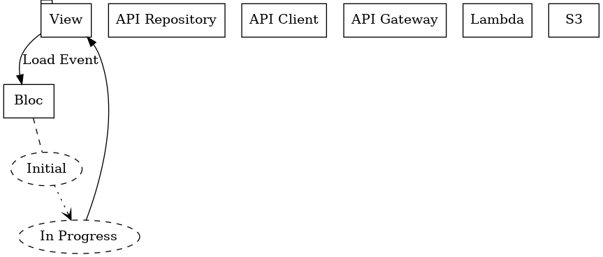

### Step 3

The Bloc extracts the parameters from the Load Event it received and passes them to the API Repository.

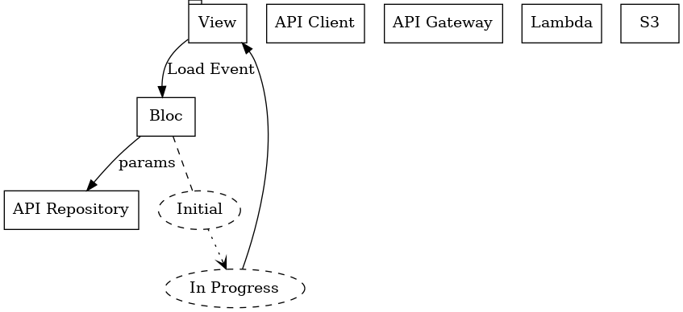

### Step 4

The API Repository sends the parameters it receives to the API Client.

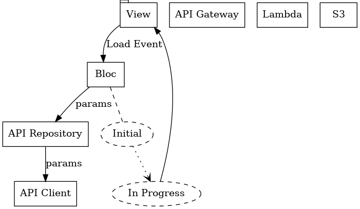

### Step 5

Unlike the previous classes, which were all written by hand, the classes in the API Client are auto-generated by OpenAPI Generator, which uses the OpenAPI specification as reference.

Using the parameters it has received, the API Client creates an HTTP request and sends it to API Gateway in AWS.

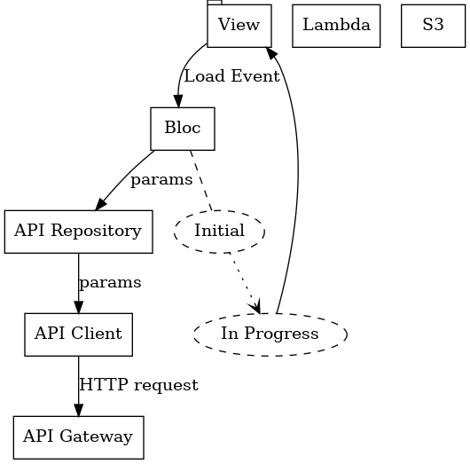

### Step 6

API Gateway calls a Lambda function.

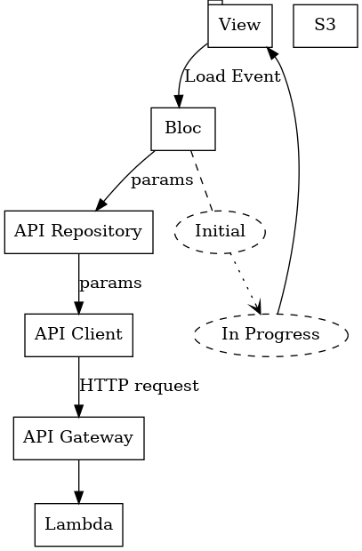

### Step 7

The Lambda function fetches data from S3 and sends it to API Gateway.

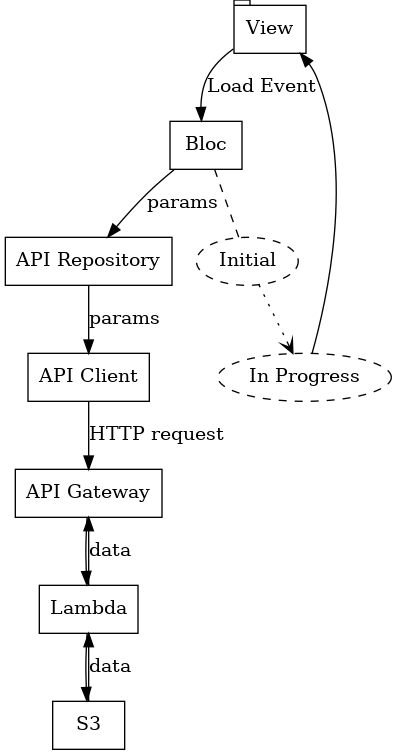

### Step 8

API Gateway creates an HTTP response containg the data it receives from the Lambda and sends it to the API Client.

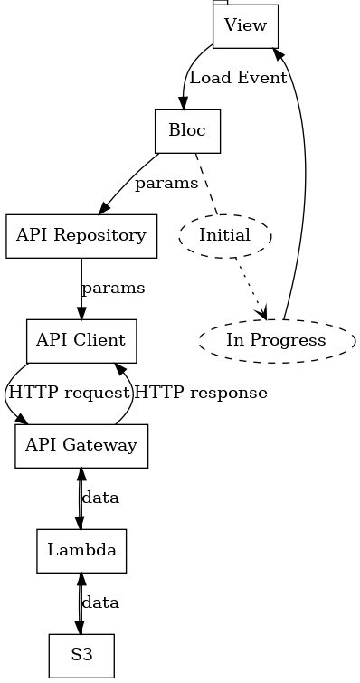

### Step 9

The API Client sends the HTTP response to the API repository.

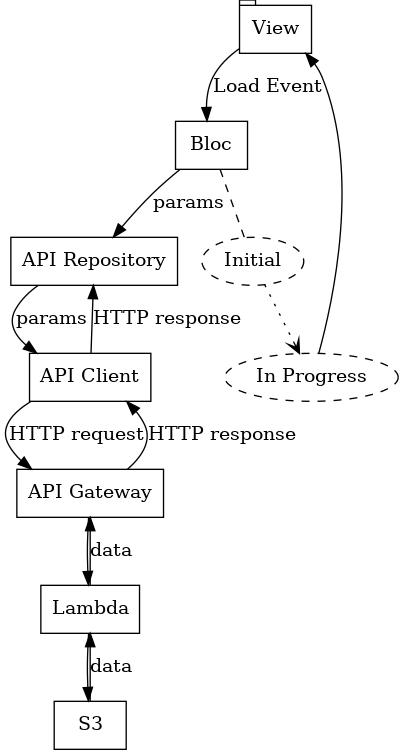

### Step 10

The API repository extracts the data from the HTTP response and sends it to the Bloc.

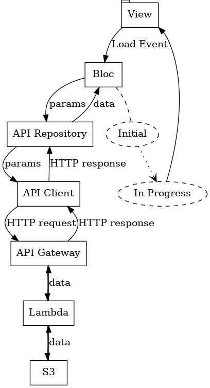

### Step 11

The Bloc emits a Success State containing the data from the API Repository.

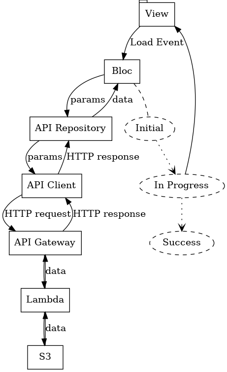

### Step 12

As soon as the Bloc emits a new state, the View reads the current state of the Bloc, sees that it's a Success State, and displays the data contained in the state.

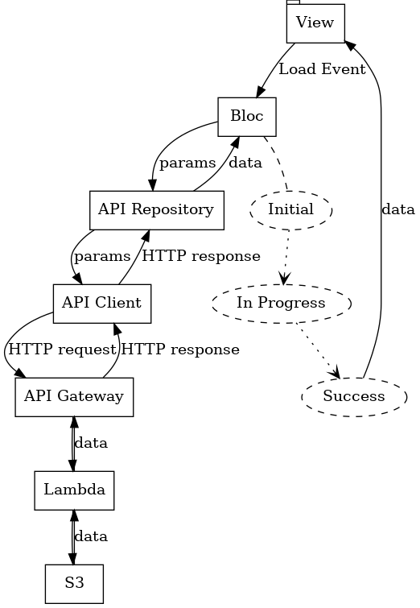

## Failure case

Steps 1-4 are the same as in the success case.

### Step 5

The API Client tries to make a call to API Gateway but fails. It throws an error.

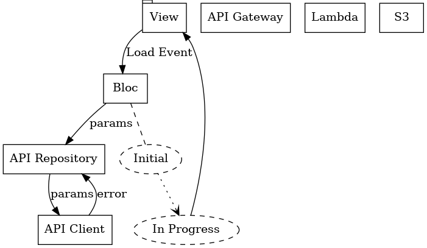

### Step 6

The API Repository catches the error and throws its own error.

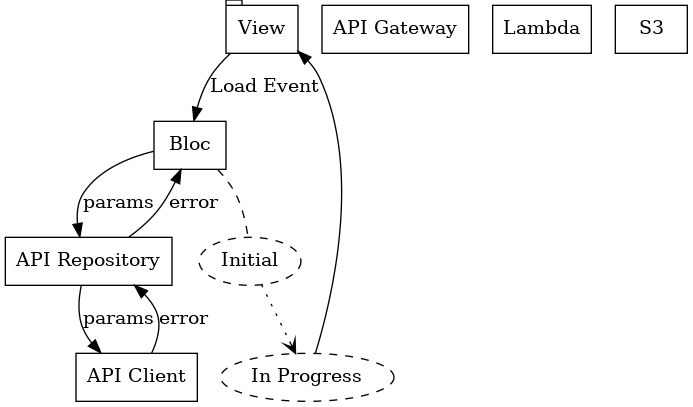

### Step 7

The Bloc catches the error and emits a Failure State.

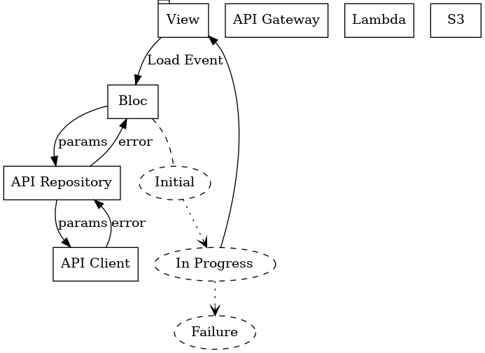

### Step 8

As soon as the Bloc emits a new state, the View reads the current state, sees that it's a Failure State, and displays an error message.

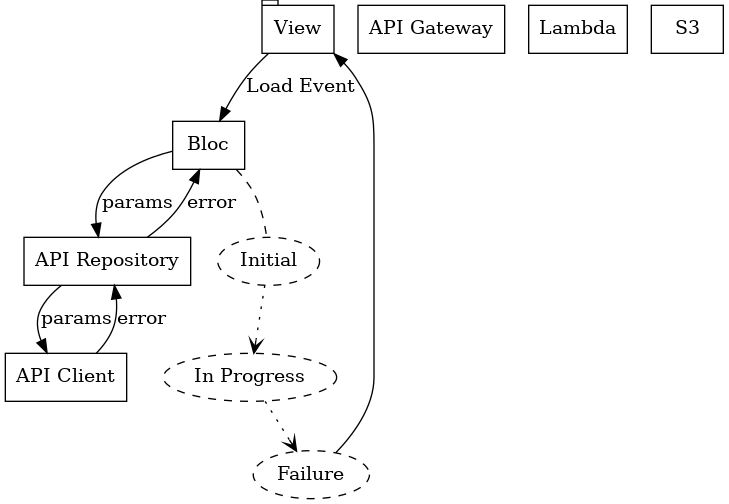
